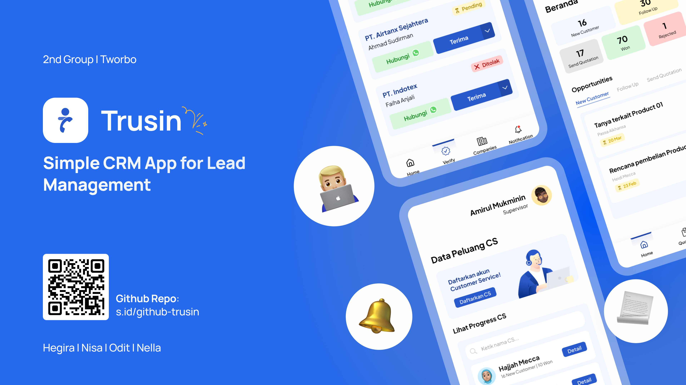

# 🚀 **Trusin – Simple CRM App for Lead Management**

**Trusin** is a simple CRM app that helps companies manage leads more easily.  
With role-based access, Supervisors can monitor progress and make sure Customer Service follows up with leads properly.

---

## 👥 **Roles**

Trusin supports **3 main roles** with different access and functionalities:

**🔒 Super Admin** – (Approves company registrations from Supervisors before access is granted.)

**👨‍💼 Supervisor**  
  - Track Customer Service (CS) progress
  - Set reminder schedules for CS  
  - View and download quotation & invoice

**🧑‍💻 Customer Service (CS)**  
  - Manage leads (CRUD) in a **Kanban-style dashboard**  
  - **Follow-up scheduling** with reminders
  - Generate, view, and download **quotations** and **invoices** 

---

## ✨ Key Features

Role-based access for Supervisor and Customer Service
Kanban-style lead management
Customizable follow-up scheduling
Quotation and invoice generation (PDF)
Real-time data using Firebase Firestore

---

## 🛠️ **Tech Stack**

**Framework**: Flutter 3.24.5  
**Language**: Dart 3.5.4 (stable)  
**Backend**: Firebase  
  - Firebase Auth  
  - Cloud Firestore  
  - Firebase Storage

---

## 📦 **Dependencies**

| Package | Version |
|--------|---------|
| cupertino_icons | ^1.0.8 |
| firebase_core | ^3.12.1 |
| firebase_auth | ^5.5.1 |
| cloud_firestore | ^5.6.5 |
| firebase_storage | ^12.4.6 |
| flutter_svg | ^2.0.17 |
| curved_navigation_bar | ^1.0.6 |
| syncfusion_flutter_charts | ^29.1.40 |
| table_calendar | ^3.2.0 |
| provider | ^6.1.5 |
| get | ^4.7.2 |
| intl | ^0.20.2 |
| url_launcher | ^6.3.1 |
| uuid | ^4.5.1 |
| image_picker | ^1.1.2 |
| flutter_pdfview | ^1.4.0+1 |
| dotted_border | ^2.1.0 |
| share_plus | ^11.0.0 |
| path | ^1.9.1 |
| permission_handler | ^12.0.0+1 |
| pdf | ^3.11.3 |
| printing | ^5.14.2 |
| open_file | ^3.5.10 |
| file_picker | ^10.1.9 |
| path_provider | ^2.1.5 |

---

## ⚙️ **Configuration**

Make sure to set the **minimum SDK version** in your android/app/build.gradle:

gradle
defaultConfig {
    // ... other configs
    minSdkVersion 23
}
